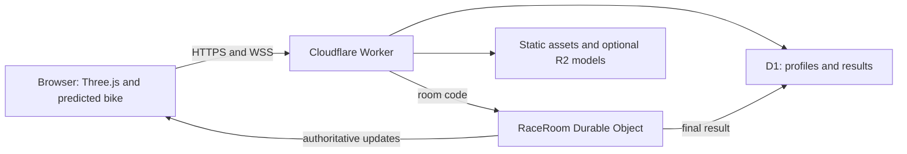

# Architecture plan for the motorcycle combat racer

Status: stack direction agreed, 2026-09-23. Capacity and gameplay details remain to be proved. No game implementation or deployment has begun.

## Goal and launch assumptions

Build an original, shareable motorcycle combat racing game for our own website. The reference is the feel of the mid-1990s Windows/3DO Road Rash: fast arcade riding, traffic, close combat, crashes, and rivalry. The game will use its own name, code, tracks, bikes, riders, art, audio, and story.

The first playable release is an indie launch for desktop browsers. The earlier "India-first" selection came from reading that option as "indie first"; there is no geographic launch restriction. Plan and load-test for hundreds of concurrent players (use 500 CCU as the capacity test), with 4-8 riders per race. Multiplayer is part of the first playable slice. Mobile, a career mode, and monetization come after the core race works.

## Decision

| Concern | Choice | Reason |
| --- | --- | --- |
| Browser | TypeScript, Vite, Three.js with WebGL 2 | One web codebase and direct control over rendering and the arcade feel. Three.js currently describes WebGPU support as experimental. |
| Tooling | Bun with a committed lockfile; Cloudflare workerd in production | Alchemy's current development and deployment guides use Bun. Production Workers run on Cloudflare, not Bun. |
| Race simulation | Shared, fixed-step TypeScript package | The server owns movement, collisions, attacks, damage, and finish order. Browser code uses the same step function for local prediction. Start with simple road-relative geometry rather than a full rigid-body bike simulation. |
| Multiplayer | Native WebSockets in a Cloudflare Durable Object, one authoritative object per race | This keeps every room independent and lets Cloudflare create rooms as demand grows. We implement the small game's prediction, interpolation, reconnection, and hit validation. |
| Hosting | Cloudflare Worker with static assets, Durable Objects, D1, and optional R2 | One provider serves the owned site, API, live rooms, and durable records. No fixed first-launch server region or warm game VM. |
| Application services | Effect at API and room boundaries | Define protocol schemas, guest identity, errors, persistence, and result ingestion. Keep the hot simulation step as a plain TypeScript function. |
| Infrastructure | Alchemy for Cloudflare resources and stages | Define the site, Worker, room namespace, D1, and later R2 in one TypeScript deployment program. Pin compatible Alchemy and Effect versions with a lockfile. |
| Durable data | Durable Object SQLite for room lifecycle; D1 for profiles, race summaries, and leaderboards; R2 when art or replays justify it | Persist race transitions and final results, not every physics frame. |
| Art | Procedural Three.js geometry for the first bikes and road; optional GLB assets later | Blender is a tool choice, not a requirement. Detailed hero bikes, riders, or landmarks can be modeled or generated separately and loaded as GLB. |

This stack deliberately uses Effect and Alchemy. Effect belongs around network, identity, storage, and error boundaries; the pure race simulation remains easy to test and profile. Alchemy currently has a beta v2 line that requires a compatible Effect 4 release candidate, so pin exact tested versions, commit the lockfile, use separate preview/staging/production stages, and smoke-test deployment before relying on an upgrade. [Alchemy release notes](https://alchemy.run/blog/2026-09-17-beta-78/), [Alchemy Cloudflare Vite guide](https://alchemy.run/cloudflare/frontend/vite-spa/), [Alchemy Durable Objects](https://alchemy.run/cloudflare/compute/durable-objects/).

Keep the implementation in a small workspace: `apps/web` for Vite and Three.js, `apps/edge` for the Worker and RaceRoom object, `packages/sim` for pure arcade rules, `packages/protocol` for Effect schemas and message types, and `infra/alchemy` for resource definitions. The browser must never call internal Durable Object RPC directly; its public protocol is a versioned WebSocket message format. [Effect Schema](https://effect.website/docs/v4/schema/introduction), [Alchemy Durable Object RPC](https://alchemy.run/cloudflare/compute/durable-objects/).

Rust or Go would add a second language and a browser/server simulation boundary now. Neither is needed to prove a small arcade room. Profile the real TypeScript tick loop first. If it becomes the limit, benchmark a Rust/WASM simulation kernel or Cloudflare Containers before changing the architecture.

## Feasibility and existing games

The original Windows game already runs in a third-party [browser emulator at DOS.Zone](https://dos.zone/road-rash/). We reached a playable race there during research, though startup was slow and the emulator reported missing-file and MIDI warnings. That proves browser delivery is possible, not that we have rights to reuse or distribute that copy. Browser-native inspired games such as [Roadkill](https://gadgaming.itch.io/roadkill) and [Road Bash](https://megacode.itch.io/road-bash) also exist. Our harder job is a polished 3D multiplayer game with predictable latency and original content.

The usual architecture for a fast multiplayer game is an authoritative room server. Clients send controls, predict their own immediate motion, and smooth remote players from server updates. The server settles hits, collisions, and results. [Colyseus's browser kart example](https://docs.colyseus.io/netcode) shows the pattern, but its Node.js room server is not part of this Cloudflare-only plan. We will implement the narrower netcode needed for 4-8 rider races inside Durable Objects. That saves a second hosting provider and means prediction, reconciliation, lag handling, and reconnect behavior need careful tests.

## How a race works

1. The browser loads the site from a Cloudflare Worker with static assets. A guest can create or join an invite race without a full account.
2. The Worker issues a short-lived signed guest identity and a random room code. It routes the WSS upgrade to the corresponding RaceRoom Durable Object. That object alone owns its room; there is no global lobby object in the first slice.
3. Each client sends bounded, sequenced control inputs, not position claims. The room advances the fixed-step race and owns collisions, hit windows, damage, traffic, placement, and finish order. Effect validates network messages and models room/session errors at the boundary; a plain TypeScript step function handles each tick.
4. The local bike responds immediately through client prediction. When a server update arrives, the client replays unacknowledged inputs and corrects its position. Other riders interpolate between updates. The server applies bounded latency compensation to melee hit checks, then broadcasts the accepted event.
5. A brief network disconnect may rejoin with the same guest identity while the room remains active. The rider then coasts or follows a documented safe input policy. The room records lifecycle transitions and occasional checkpoints in Durable Object SQLite, then records a final result there before attempting a D1 write. D1 uses a unique race ID so retries cannot duplicate a result. If the object loses its in-memory race and cannot restore a valid checkpoint after a host failure, mark that race aborted rather than fabricate a winner. Idle rooms may hibernate after the race timer stops; active ticking rooms remain awake. On an idle wake, rebuild attached player sessions from WebSocket attachments.

The starting tuning hypothesis is a 30 Hz server simulation, 20 input updates per second per rider, and 10-20 state updates per second, with a 60 FPS browser target on a representative desktop. These are design inputs, not measured capacity claims. Tune them after network and device tests. Shared TypeScript rules help prediction but do not guarantee byte-identical floating-point replay across browsers; server state remains authoritative. Cloudflare's hibernation WebSocket API can keep idle sockets connected, but scheduled tick timers prevent hibernation during an active race. [Cloudflare WebSockets](https://developers.cloudflare.com/durable-objects/best-practices/websockets/), [Durable Object lifecycle](https://developers.cloudflare.com/durable-objects/concepts/durable-object-lifecycle/), [Alchemy hibernation guide](https://alchemy.run/cloudflare/compute/hibernatable-websockets/).

## Concurrency and traffic

Rooms are independent. At 500 CCU, 4-8 rider rooms mean roughly 63-125 live Durable Objects; at a six-rider average, about 84. At 20 input updates per rider per second, 500 CCU means about 10,000 incoming input messages per second spread across those objects. A six-rider room sees about 120 input messages per second plus joins, ticks, and broadcasts. These are arithmetic inputs to a load test, not throughput claims. A room's single-threaded simulation and message fan-out are the capacity boundary. Cloudflare documents a soft limit of 1,000 requests per second for one object, but real game work can hit CPU or latency limits sooner. [Durable Object limits](https://developers.cloudflare.com/durable-objects/platform/limits/).

Start with invite rooms, so a random room code maps to exactly one object. Do not create a single global room list or matchmaking object. Add public matchmaking later, sharded by mode and broad region if measured demand calls for it. Cloudflare can create many room objects without pre-provisioning VM capacity. Location follows Cloudflare's placement system; hints are best effort and cannot promise a specific city. Measure connection latency from the actual player mix before adding regional queues. [Durable Object placement](https://developers.cloudflare.com/durable-objects/reference/data-location/).

Before opening to hundreds of players, run synthetic clients from several networks through the entire join, race, attack, reconnect, and finish path at 500 CCU, then test a burst above that number. Record per-room tick time and missed deadlines, memory, WebSocket ingress and fan-out, room join time, disconnect rate, input-to-authoritative update latency, browser frame time, and Cloudflare cost per player-hour. Tune room size, message format, tick rate, and snapshot rate from those measurements. Cap new room admission if deployed measurements show a limit; keep active races responsive.

Cloudflare bills incoming WebSocket messages at a 20:1 ratio for Durable Object request billing and does not charge for outgoing WebSocket messages as requests. Active rooms accrue duration charges; hibernation saves duration only when the timer and other blockers are gone. As a rough **Durable Object-only** example using the current paid-plan rates and a 30-day month, 500 players racing for one hour each day in six-rider rooms at 20 inputs per second would add about $17 per month after the included Durable Object allocation, plus the Workers plan and any other usage. If 500 players stayed in active races around the clock, the same assumptions give roughly $532 per month of Durable Object usage. These are illustrations, not a total hosting quote: actual occupancy, race duration, reconnects, D1, R2, and Worker usage must be measured. [Durable Object pricing](https://developers.cloudflare.com/durable-objects/platform/pricing/), [Workers pricing](https://developers.cloudflare.com/workers/platform/pricing/).

## Deployment and operations

Use Alchemy's local development stage for quick iteration, a disposable preview stage for each reviewed change, then staging and production stages. A preview deployment must demonstrate an HTTPS page, guest identity, Worker-to-room routing, two WSS clients, Effect protocol validation, a completed result, and idle room wake-up. Promote only the tested dependency set. An Alchemy dry run should be reviewed before production resource changes. [Alchemy deploy guide](https://alchemy.run/cli/deploy/), [Alchemy WebSocket guide](https://alchemy.run/cloudflare/compute/hibernatable-websockets/).

Collect room metrics by stage: active rooms and riders, join failures, reconnects, tick overruns, message rates, bytes sent, result write retries, and Durable Object duration. Keep result writes idempotent across retries and deploys. During a rollout, avoid changing the WebSocket protocol for riders already in a race; accept the previous protocol version until those short races finish or abort them explicitly with no result. Stage resource credentials separately and never place secrets in client bundles.

## Graphics and game scope

Use low-poly, readable shapes first: a short road, traffic, four distinguishable bikes, clear leaning and hit poses, strong camera motion, and effects that communicate contact. Procedural meshes and instancing are fine for road pieces, barriers, traffic, and placeholder bikes. Use sprites or billboards for dust and distant scenery. Add GLB models where silhouette and animation matter, regardless of whether Blender or another tool produced them. Set a download and frame-time budget after profiling the first playable scene. [Three.js renderer](https://threejs.org/docs/pages/WebGLRenderer.html), [GLTFLoader](https://threejs.org/docs/pages/GLTFLoader.html), [InstancedMesh](https://threejs.org/docs/pages/InstancedMesh.html).

The first race contains one road, traffic, steering and braking, one melee move, hit feedback, a crash/recovery loop, an invite link, and a verified finish order. It uses original placeholder riders. The specific cast, satire, progression, maps, and monetization should be designed after the riding and multiplayer feel are proven.

## IP and commercial release

Build around the broad racing and combat concept, not Road Rash branding, music, characters, artwork, dialogue, or code. Use an original product name and clear it before publication. The user wants parody riders based on real public figures. A renamed but recognizable face, voice, or persona can still create publicity and endorsement claims, especially in a commercial game. Keep early test riders fictional composites. Before shipping any identifiable parody, review the exact model, lines, context, store page, ads, and intended markets with qualified counsel. [U.S. Copyright Office on games](https://www.copyright.gov/register/tx-games.html), [Delhi High Court Anil Kapoor order](https://delhihighcourt.nic.in/app/downloadOrderbByDate/CS%28COMM%29/652/2023/20-09-2023), [Keller v. EA](https://law.justia.com/cases/federal/appellate-courts/ca9/10-15387/10-15387-2013-07-31.html), [Winter v. DC Comics](https://law.justia.com/cases/california/supreme-court/2003/s108751.html).

Treat monetization as a separate design decision after a fun, stable race. Cosmetics are a possible starting point if they do not affect combat balance. Before any payment flow, make account persistence, entitlements, refunds, and regional tax handling part of the design.

## Delivery sequence and proof

1. **Deployment and networking spike.** Pin Alchemy and Effect together. Provision a preview Worker and one RaceRoom Durable Object with Alchemy. Connect two browser tabs over WSS. Prove Worker-to-object routing, WebSocket messages, idle hibernation, and an Effect-validated guest/session boundary before adding art.
2. **First playable race.** Shared TypeScript simulation drives speed and steering; the room rejects impossible client inputs. Four humans on the owned staging site race one short route. Add traffic, one attack, collision, crash recovery, reconnect, and the same finish order on all clients. Test latency simulation and real players on different networks.
3. **Capacity and cost gate.** Run 500 synthetic CCU with realistic room churn, attack traffic, and several client locations. Capture the metrics above, check the Cloudflare bill against the model, and tune room size and rates. Add admission control before a public promotion.
4. **Visual and content pass.** Replace placeholders selectively with original models, animation, sound, and the chosen visual style. Set scene performance and asset budgets on representative desktop machines.
5. **Commercial gate.** Clear the name and rider designs, settle the progression and monetization model, and add abuse controls, support, analytics, and payment operations before a broad launch.

The next work session should settle the core game feel: speed, steering weight, combat timing, camera, and how traffic changes a race. Those choices drive the simulation and visual direction. The architecture is ready for a two-player technical spike, but this document remains a planning artifact until the user asks to build.

## Sources checked

- [Cloudflare Durable Object WebSockets](https://developers.cloudflare.com/durable-objects/best-practices/websockets/), [lifecycle](https://developers.cloudflare.com/durable-objects/concepts/durable-object-lifecycle/), [limits](https://developers.cloudflare.com/durable-objects/platform/limits/), and [pricing](https://developers.cloudflare.com/durable-objects/platform/pricing/)
- [Alchemy beta release notes](https://alchemy.run/blog/2026-09-17-beta-78/), [Cloudflare Vite guide](https://alchemy.run/cloudflare/frontend/vite-spa/), [Durable Object resource](https://alchemy.run/cloudflare/compute/durable-objects/), and [Hibernatable WebSockets guide](https://alchemy.run/cloudflare/compute/hibernatable-websockets/)
- [Three.js WebGLRenderer](https://threejs.org/docs/pages/WebGLRenderer.html) and [GLTFLoader](https://threejs.org/docs/pages/GLTFLoader.html)
